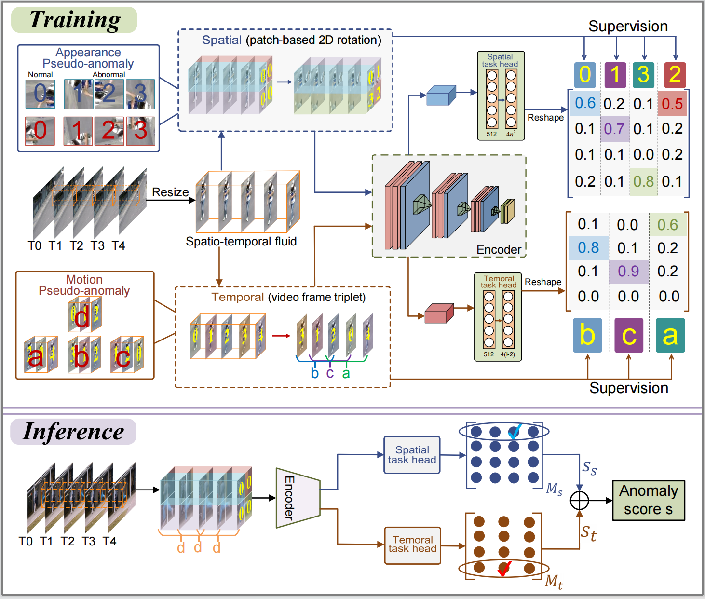

# spatio-temporal-tasks
spatio-temporal tasks



# Environments
- python 3.7.10
- pytorch 1.7.1
- torchvision 0.8.2
- scipy 1.7.1
- opencv-python 4.5.4.58
- pillow 9.5.0
- numpy 1.21.6
# Data Preparation
Please make sure that you have sufficient storage.
```
python gen_patches.py --dataset shanghaitech --phase test --filter_ratio 0.8 --sample_num 9
```
|    Dataset    | # Patch (train) |  # Patch (test) |  filter ratio  |  sample num  |  storage  |
|:-------------:|:---------------:|:---------------:|:--------------:|:------------:|:---------:|
|      Ped2     |       27660     |       31925     |       0.5      |       7      |     20G   |
|     Avenue    |       96000     |       79988     |       0.8      |       7      |     58G   |
|  Shanghaitech |      145766     |      130361     |       0.8      |       9      |    119G   |

# Training
```
python main.py --dataset shanghaitech --val_step 100 --print_interval 20 --batch_size 192 --sample_num 9 --epochs 100 --static_threshold 0.2
```

# Testing
```
python main.py --dataset shanghaitech/avenue/ped --sample_num 9/7/7 --checkpoint xxx.pth
```
We provide the pre-trained weights for [STC](https://pan.baidu.com/s/15B0BHHKStC-od7SDNFGWmA?pwd=quzj 
extraction code：quzj), [Avenue](https://pan.baidu.com/s/1f2sygbR1qbLTDHzznKKFWA?pwd=y260 
extraction code：y260) and [Ped2](https://pan.baidu.com/s/1AqunzApvvbevarVMeF0w3Q?pwd=wa83 
extraction code：wa83).
